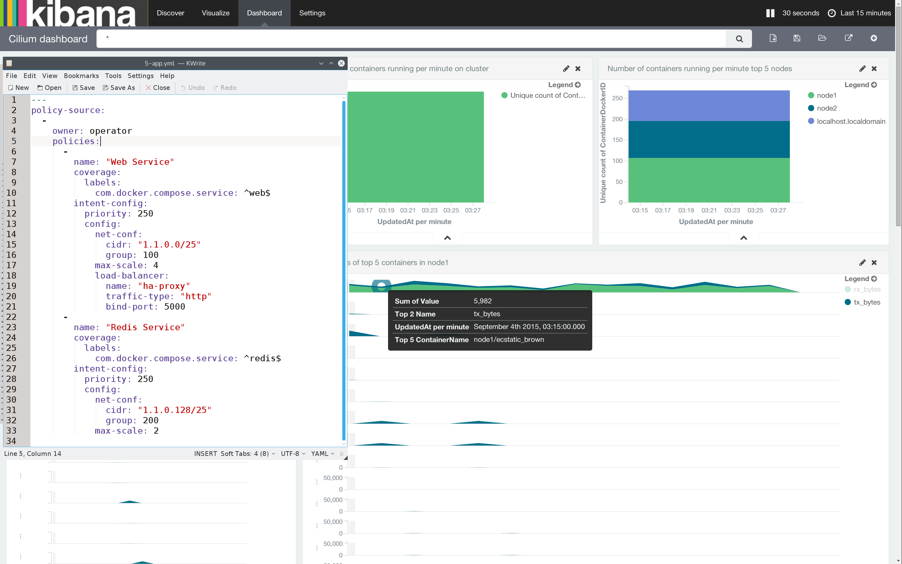
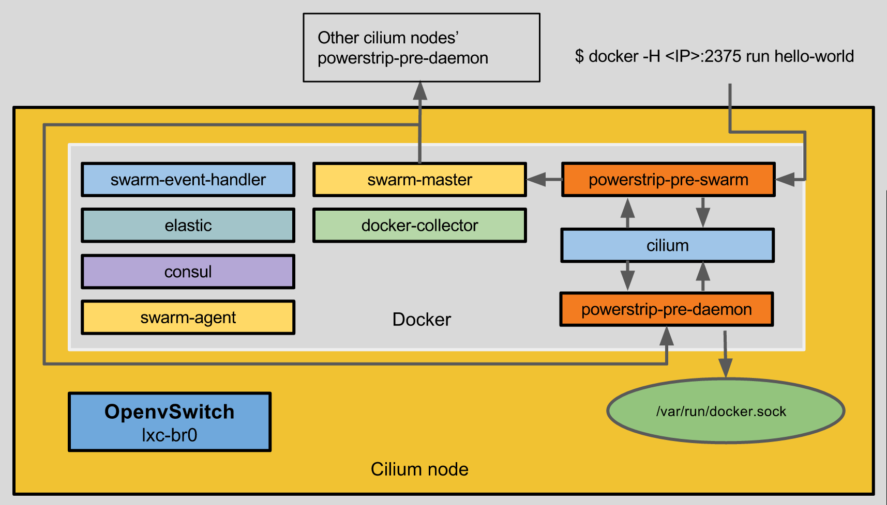
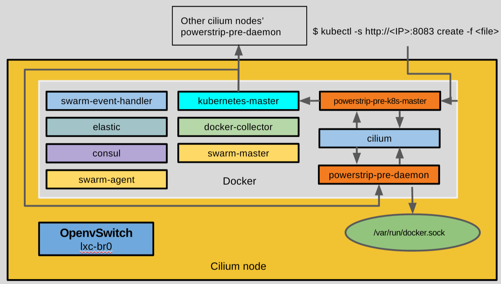
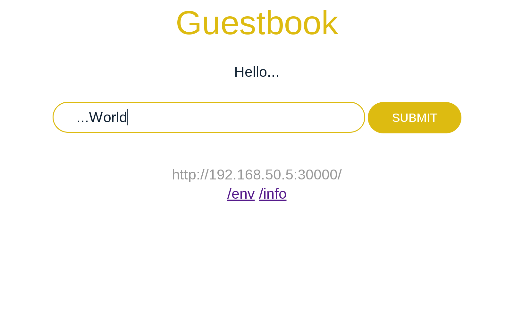

# cilium: Operational Constraints and Policies for Container Clusters



Cilium is an open source project to define and enforce operational constraints
and policies for container clusters. Policies are defined in YAML and associated
with containers using labels. The enforcement of the policies is enforced by
either cilium itself or plumbing plugins depending on the policy specified.

This initial version is bound to Docker and Kubernetes using powerstrip but the
architecture allows for integration with Mesosphere as well.

TOC
===
* [How to run cilium](#how-to-run-cilium)
* [Docker](#docker)
    * [Requirements for each node](#requirements-for-each-node)
    * [Re-check all dependencies on each node](#re-check-all-dependencies-on-each-node)
    * [Preparing a node](#preparing-a-node)
    * [Infecting a node](#infecting-a-node)
  * [Compose demo](#compose-demo)
    * [Getting docker-compose and app-policy](#getting-docker-compose-and-app-policy)
  * [Kibana](#kibana)
* [Kubernetes](#kubernetes)
    * [Requirements for each node](#requirements-for-each-node-1)
    * [Re-check all dependencies on each node](#re-check-all-dependencies-on-each-node-1)
    * [Preparing a node](#preparing-a-node-1)
    * [Creating the master node](#creating-the-master-node)
    * [Creating workers](#creating-workers)
  * [Guestbook demo](#guestbook-demo)
    * [Getting policy and kubernetes files](#getting-policy-and-kubernetes-files)
* [F.A.Q.](#faq)
  * [Why am I getting json: cannot unmarshal number into Go value of type []types.Container?](#why-am-i-getting-json-cannot-unmarshal-number-into-go-value-of-type-typescontainer)
  * [Why am I getting a Error: dial unix /var/run/docker.sock: permission denied?](#why-am-i-getting-a-error-dial-unix-varrundockersock-permission-denied)
  * [Why do I have to open port all of those ports in my firewall?](#why-do-i-have-to-open-port-all-of-those-ports-in-my-firewall)
* [License](#license)

# How to run cilium

There are 3 configurations to deploy cilium and you should follow only one of
those steps depending your final goal:
- [infecting a node for docker](#docker)
- [creating a kubernetes cluster](#kubernetes)
- [development](./docs/CONTRIBUTING.md#installation-for-developers)

# Docker

If you want to test `cilium` in your docker cluster, make sure you have the
following requirements:

### Requirements for each node

- Docker (>=1.8.0) (tested with 1.9.0)
- Open vSwitch (>=2.3.2) (tested with 2.4.0) (for each node)
- ~5 GB free disk space (for each node)
- Compose (>=1.3.0) (tested with 1.5.0) (for demo purposes)

### Re-check all dependencies on each node

Make sure you have all requirements checked.

* `curl -Ssl https://raw.githubusercontent.com/cilium-team/cilium/master/entrypoint.sh | bash -s check`

### Preparing a node

You can skip this step but we don't recommend it to skip it since it will allow
a faster deployment of cilium's components on the specific node. This step will
pull all docker images on that node so the first deployment can be faster.

* `curl -Ssl https://raw.githubusercontent.com/cilium-team/cilium/master/entrypoint.sh | bash -s prepare`

### Infecting a node

We will now infect a node with `cilium` components (more info about these
components [here](docs/CONTRIBUTING.md#what-is-a-policy-file)) that will allow
us to deploy your applications into your `cilium` cluster.



*You will need to open the ports 80, 2371, 2373, 5000, 8080, 8300, 8301
(tcp/udp), 8302 (tcp/udp), 8400, 8500, 9200 and 9300 on your firewall to receive
tcp traffic and 53, 4789, 54328 for udp traffic.
([Why?](#why-do-i-have-to-open-port-all-of-those-ports-in-my-firewall))*

On the first node of a cluster that will be infected, you have to provide the
following environment variables:

* `IP` - reachable node's IP from all remaining nodes. __Don't__ use
`127.0.0.1`. For example, `192.168.50.37` is fine.
* `NET_IP` - network address of the reachable node's IP. For example,
`192.168.50.0/24` if the node is on a network with the netmask `255.255.255.0`.

In our example we have:

* `# curl -Ssl https://raw.githubusercontent.com/cilium-team/cilium/master/entrypoint.sh | NET_IP=192.168.50.0/24 IP=192.168.50.37 bash -s infect`

In your case you should rewrite `NET_IP` and `IP` accordingly your network
settings:

* `curl -Ssl https://raw.githubusercontent.com/cilium-team/cilium/master/entrypoint.sh | NET_IP=<node's network address> IP=<node's IP address> bash -s infect`

If you only have one node in your cluster that's ok, you can go to
[compose-example](#compose-demo) step to complete the demo.

The second and remaining nodes will only require the following environment
variables:

* `IP` - reachable node's IP from all remaining nodes. __Don't__ use
`127.0.0.1`. For example `192.168.50.38` is fine.
* `MASTER_IP` - network address of __one__ of the infected nodes. For example,
the first node we infected had the IP `192.168.50.37` so we will use this
one as `MASTER_IP`.

In our example we have:

* `# curl -Ssl https://raw.githubusercontent.com/cilium-team/cilium/master/entrypoint.sh | MASTER_IP=192.168.50.38 IP=192.168.50.37 bash -s infect`

* `curl -Ssl https://raw.githubusercontent.com/cilium-team/cilium/master/entrypoint.sh | MASTER_IP=<An already infected node's IP address> IP=<node's IP address> bash -s infect`

At this point you should have 9+2 containers on each node. For example, in one
of the nodes we have:

*(you probably don't have the `swarm-master` command, please go
[here](#why-am-i-getting-json-cannot-unmarshal-number-into-go-value-of-type-typescontainer))*

```bash
$ swarm-master docker ps -a  --format 'table {{.ID}}\t{{.Image}}\t{{.Status}}\t{{.Names}}'
CONTAINER ID        IMAGE                              STATUS              NAMES
d141780d59b2        cilium/docker-collector:latest     Up 6 minutes        node2/cilium-docker-collector
cf3e329c9a24        cilium/cilium                      Up 6 minutes        node2/cilium-swarm-event-handler
f4ca2699a644        swarm:1.0.0                        Up 6 minutes        node2/cilium-swarm-master
5983cec8cc1b        swarm:1.0.0                        Up 6 minutes        node2/cilium-swarm-agent
24af1ac8e4a3        cilium/powerstrip:latest           Up 7 minutes        node2/cilium-powerstrip-pre-daemon
3befe78a69cc        cilium/powerstrip:latest           Up 7 minutes        node2/cilium-powerstrip-pre-swarm
a80915511fe2        cilium/cilium                      Up 7 minutes        node2/cilium
6cf49abe8237        elasticsearch:1.7.1                Up 7 minutes        node2/cilium-elastic
30343151fde0        progrium/consul                    Up 7 minutes        node2/cilium-consul
```

The remaining 2 containers are the `cilium` services, the load balancer and the
DNS. You can find them by running:

```
$ swarm-master docker ps -a --filter=name=cilium-dns --format 'table {{.ID}}\t{{.Image}}\t{{.Status}}\t{{.Names}}'
CONTAINER ID        IMAGE                                    STATUS              NAMES
bd820c3fa3fc        cilium/docker-dns-rest:1.0-rr-with-del   Up 6 minutes        localhost/cilium-dns
$ swarm-master docker ps -a --filter=name=cilium-loadbalancer --format 'table {{.ID}}\t{{.Image}}\t{{.Status}}\t{{.Names}}'
CONTAINER ID        IMAGE                                    STATUS              NAMES
753a75b39dff        tnolet/haproxy-rest                      Up 6 minutes        node1/cilium-loadbalancer
```

Congratulations you have setup a `cilium` cluster! Go to the [compose-example](#compose-demo)
step to complete the demo.

## Compose demo

To continue this demo please make sure you've [docker-compose](https://docs.docker.com/compose/install/)
(>=1.3.0) installed in the node were you'll execute the demo.

### Getting docker-compose and app-policy

Get the following files:
```bash
$ curl -Ssl -o docker-compose.yml https://raw.githubusercontent.com/cilium-team/cilium/master/examples/compose/docker-compose.yml
$ curl -Ssl -o app-policy.yml https://raw.githubusercontent.com/cilium-team/cilium/master/examples/compose/app-policy.yml
```

Inside that directory you should have:

* `docker-compose.yml` - is a normal compose file without any modifications.
* `app-policy.yml` - is cilium's policies that will be enforced accordingly
the given coverage. To understand how this enforced go to
[what is a policy file?](./docs/CONTRIBUTING.md#what-is-a-policy-file)

We have to store `app-policy.yml` in our distributed database. For so, run:

```
docker run --rm \
    -e ELASTIC_IP=<any-nodes-reachable-IP> \
    -v $PWD/app-policy.yml:/opt/cilium/policies/ \
    cilium/cilium -f /opt/cilium/policies
```

*Don't forget it should be the full path or it won't work, that's why we have
written the $PWD*

Now run `swarm-master docker-compose up -d`, this will start both services
(`redis` and `web`).

*(you probably don't have the `swarm-master` command, please go
[here](#why-am-i-getting-json-cannot-unmarshal-number-into-go-value-of-type-typescontainer))*

```bash
$ swarm-master docker ps -a
CONTAINER ID        IMAGE                    COMMAND                  CREATED             STATUS              PORTS               NAMES
168640ceb0ae        cilium/compose-example   "python app.py"          2 minutes ago       Up 2 minutes                            node1/compose_web_1
2d5b35eb1dd5        redis                    "/entrypoint.sh redis"   3 minutes ago       Up 3 minutes                            node1/compose_redis_1
...
```
*If redis is running in your physical machine and you have a firewall enabled,
you must open port 6379*

To test `web` container, open a new terminal and find out the tcp ports the
load-balancer has open.
```bash
$ swarm-master docker ps -a --filter=name=cilium-loadbalancer
CONTAINER ID        IMAGE                 COMMAND             CREATED             STATUS              PORTS                                                                                             NAMES
6d96555a4395        tnolet/haproxy-rest   "/haproxy-rest"     17 minutes ago      Up 17 minutes       192.168.50.5:1988->1988/tcp, 192.168.50.5:5000->5000/tcp, 80/tcp, 192.168.50.5:10001->10001/tcp   node1/cilium-loadbalancer
```

I our case we can see there's the `192.168.50.5:5000`, in your case should be
the same IP of one of the cluster's nodes with the port 5000.
The load balancer round-robin the requests through `web` containers available.
Since we only have 1 container running service `web`, all requests go to that
container.

```bash
$ curl 192.168.50.5:5000
Hello World! I have been seen 1 times.
```

Next we are going to scale up `web` to 3 containers. Go to the terminal were
you have the `docker-compose.yml` file and run:

```bash
$ swarm-master docker-compose scale web=3
```
You have successfully scaled the `web` service on to 3 containers.

To see it, run:
```bash
$ swarm-master docker-compose logs web
```
And leave this terminal open.

On the other terminal run *don't forget in our example we have 192.168.50.5 and
your IP might be different*:

```bash
$ curl 192.168.50.5:5000
Hello World! I have been seen 2 times.
$ curl 192.168.50.5:5000
Hello World! I have been seen 3 times.
```

and you can see under the first terminal that the requests are being round-robin
through the 3 web containers:

```bash
web_1 | 1.1.0.251 - - [08/Jul/2015 02:42:06] "GET / HTTP/1.1" 200 -
web_2 | 1.1.0.251 - - [08/Jul/2015 02:42:07] "GET / HTTP/1.1" 200 -
web_3 | 1.1.0.251 - - [08/Jul/2015 02:42:08] "GET / HTTP/1.1" 200 -
```

## Kibana

All GETs previously performed were counted by `cilium-docker-collector`
container.

You can see those statistics them by running:

* `curl -Ssl https://raw.githubusercontent.com/cilium-team/cilium/master/entrypoint.sh | IP=<node's IP address> bash -s start-kibana`

* Open your browser in [kibana's dashboard](http://127.0.0.1:5601/#/dashboard/Cilium-dashboard?_g=(refreshInterval:(display:'30%20seconds',pause:!f,section:1,value:30000),time:(from:now-15m,mode:quick,to:now))&_a=(filters:!(),query:(query_string:(analyze_wildcard:!t,query:'*')),title:Cilium-dashboard))

*If the webpage is not available make sure the IP is the same IP of the node
where you are running Kibana and the port 5601 is open that node's firewall*

* You'll see pretty graphs with network traffic logged.

You can also see some ElasticSearch cluster statistics under [http://127.0.0.1:9200/_plugin/marvel/](http://localhost:9200/_plugin/marvel/)

# Kubernetes

If you want to test `cilium` with kubernetes make sure you have an "empty"
cluster since cilium has its own its own version of the `master.sh` and
`worker.sh` kubernetes scripts ([original](https://github.com/kubernetes/kubernetes/tree/master/docs/getting-started-guides/docker-multinode)
and [cilium version](https://github.com/cilium-team/cilium/tree/master/scripts/kubernetes))

### Requirements for each node


- Docker (>=1.8.0) (tested with 1.9.0)
- Open vSwitch (>=2.3.2) (tested with 2.4.0) (for each node)
- ~5 GB free disk space (for each node)

### Re-check all dependencies on each node

Make sure you have all requirements checked.

* `curl -Ssl https://raw.githubusercontent.com/cilium-team/cilium/master/entrypoint.sh | bash -s check`

### Preparing a node

You can skip this step but we don't recommend it to skip it since it will allow
a faster deployment of cilium's components on the specific node. This step will
pull all docker images on that node so the first deployment can be faster.

* `curl -Ssl https://raw.githubusercontent.com/cilium-team/cilium/master/entrypoint.sh | bash -s prepare`

### Creating the master node

We will now infect a node with `cilium` components (more info about these
components [here](docs/CONTRIBUTING.md#what-is-a-policy-file)) that will allow
us to deploy your applications into your `cilium` cluster.



*You will need to open the ports 80, 2371, 2373, 5000, 8080, 8300, 8301
(tcp/udp), 8302 (tcp/udp), 8400, 8500, 9200 and 9300 on your firewall to receive
tcp traffic and 53, 4789, 54328 for udp traffic.
([Why?](#why-do-i-have-to-open-port-all-of-those-ports-in-my-firewall))*

On kubernetes architecture first you must deploy a master and then the worker
nodes. On master you need to provide the following environment variables:

* `IP` - reachable node's IP from all remaining nodes. __Don't__ use
`127.0.0.1`. For example, `192.168.50.37` is fine.
* `NET_IP` - network address of the reachable node's IP. For example,
`192.168.50.0/24` if the node is on a network with the netmask `255.255.255.0`.

In our example we have:

* `# curl -Ssl https://raw.githubusercontent.com/cilium-team/cilium/master/entrypoint.sh | NET_IP=192.168.50.0/24 IP=192.168.50.37 bash -s infect-kubernetes`

In your case you should rewrite `NET_IP` and `IP` accordingly your network
settings:

* `curl -Ssl https://raw.githubusercontent.com/cilium-team/cilium/master/entrypoint.sh | NET_IP=<node's network address> IP=<node's IP address> bash -s infect-kubernetes`

### Creating workers

The second and remaining nodes will only require the following environment
variables:

* `IP` - reachable node's IP from all remaining nodes. __Don't__ use
`127.0.0.1`. For example `192.168.50.38` is fine.
* `MASTER_IP` - network address of the *master* node. For example, the first
node we infected was the master and had the IP `192.168.50.37` so we will use
this one as `MASTER_IP`.

In our example we have:

* `# curl -Ssl https://raw.githubusercontent.com/cilium-team/cilium/master/entrypoint.sh | MASTER_IP=192.168.50.38 IP=192.168.50.37 bash -s infect-kubernetes`

* `curl -Ssl https://raw.githubusercontent.com/cilium-team/cilium/master/entrypoint.sh | MASTER_IP=<An already infected node's IP address> IP=<node's IP address> bash -s infect-kubernetes`

At this point you should have 10+2+6 containers on master node. In our master we
have:

* 10 cilium containers

* 2 cilium services containers

* 6 kubernetes containers

```bash
$ docker ps -a  --format 'table {{.ID}}\t{{.Image}}\t{{.Status}}\t{{.Names}}'
CONTAINER ID        IMAGE                                       STATUS              NAMES
a9cb1f1b0e0f        gcr.io/google_containers/hyperkube:v1.0.3   Up 9 minutes        k8s_scheduler.2b8ee744_k8s-master-192.168.50.5_default_82b47e8581e171a8c3f38c284b8a0579_609dd68b
4dd9a18ae8c0        gcr.io/google_containers/hyperkube:v1.0.3   Up 9 minutes        k8s_apiserver.a94f0183_k8s-master-192.168.50.5_default_82b47e8581e171a8c3f38c284b8a0579_8c0065f2
693fafb49ed3        gcr.io/google_containers/hyperkube:v1.0.3   Up 9 minutes        k8s_controller-manager.19f4ee5e_k8s-master-192.168.50.5_default_82b47e8581e171a8c3f38c284b8a0579_b6012ab8
a1a7634528a7        gcr.io/google_containers/pause:0.8.0        Up 9 minutes        k8s_POD.e4cc795_k8s-master-192.168.50.5_default_82b47e8581e171a8c3f38c284b8a0579_0b408b91
f4084f065901        gcr.io/google_containers/hyperkube:v1.0.3   Up 9 minutes        jovial_colden
dd92ebbb771b        gcr.io/google_containers/hyperkube:v1.0.3   Up 9 minutes        kickass_einstein
4f767c4be716        tnolet/haproxy-rest                         Up 9 minutes        cilium-loadbalancer
f5825420d306        cilium/docker-dns-rest:1.0-rr-with-del      Up 9 minutes        cilium-dns
d9c9b66001be        cilium/docker-collector:latest              Up 9 minutes        cilium-docker-collector
4be30cb51d74        cilium/cilium                               Up 9 minutes        cilium-swarm-event-handler
c55f4d4b07a8        swarm:1.0.0                                 Up 9 minutes        cilium-swarm-master
5aa623677592        swarm:1.0.0                                 Up 9 minutes        cilium-swarm-agent
6600d4c10741        cilium/powerstrip:latest                    Up 9 minutes        cilium-powerstrip-pre-daemon
9b2e29e14206        cilium/powerstrip:latest                    Up 9 minutes        cilium-powerstrip-pre-pwr-daemon
caec49216ecc        cilium/powerstrip:kubernetes                Up 9 minutes        cilium-powerstrip-pre-k8s-master
61198d612130        cilium/cilium                               Up 9 minutes        cilium
ad30fdb13479        elasticsearch:1.7.1                         Up 9 minutes        cilium-elastic
266ef86a03d4        progrium/consul                             Up 9 minutes        cilium-consul
```

The 2 containers are the `cilium` services, the load balancer and the DNS can be
found by running:

```
$ docker ps -a --filter=name=cilium-dns --format 'table {{.ID}}\t{{.Image}}\t{{.Status}}\t{{.Names}}'
CONTAINER ID        IMAGE                                    STATUS              NAMES
f5825420d306        cilium/docker-dns-rest:1.0-rr-with-del   Up 11 minutes       cilium-dns
$ docker ps -a --filter=name=cilium-loadbalancer --format 'table {{.ID}}\t{{.Image}}\t{{.Status}}\t{{.Names}}'
CONTAINER ID        IMAGE                 STATUS              NAMES
4f767c4be716        tnolet/haproxy-rest   Up 12 minutes       cilium-loadbalancer
```

On the worker nodes you should have 9+2 containers:

* 9 cilium containers

* 2 kubernetes containers

Congratulations you have setup a `cilium` kubernetes cluster! Go to the
[guestbook-example](#guestbook-demo) step to complete the demo.

## Guestbook demo

Kubernetes offers a demo to see your cluster running, we will use that same demo
with some modifications that we will explain.

### Getting policy and kubernetes files

Get the following files:
```bash
$ curl -Ssl -o 1-redis-master-controller.json https://raw.githubusercontent.com/cilium-team/cilium/master/examples/kubernetes/1-redis-master-controller.json
$ curl -Ssl -o 2-redis-master-service.json https://raw.githubusercontent.com/cilium-team/cilium/master/examples/kubernetes/2-redis-master-service.json
$ curl -Ssl -o 3-redis-slave-controller.json https://raw.githubusercontent.com/cilium-team/cilium/master/examples/kubernetes/3-redis-slave-controller.json
$ curl -Ssl -o 4-redis-slave-service.json https://raw.githubusercontent.com/cilium-team/cilium/master/examples/kubernetes/4-redis-slave-service.json
$ curl -Ssl -o 5-guestbook-controller.json https://raw.githubusercontent.com/cilium-team/cilium/master/examples/kubernetes/5-guestbook-controller.json
$ curl -Ssl -o 6-guestbook-service.json https://raw.githubusercontent.com/cilium-team/cilium/master/examples/kubernetes/6-guestbook-service.json
$ curl -Ssl -o app-policy.yml https://raw.githubusercontent.com/cilium-team/cilium/master/examples/kubernetes/policy/app-policy.yml
```

Inside that directory you should have:

* 6 `.json` files - they are the same files used in kubernetes guestbook-go
example the original example is [here](https://github.com/kubernetes/kubernetes/tree/master/examples/guestbook-go).

* `app-policy.yml` - is cilium's policies that will be enforced accordingly
the given coverage. To understand how this enforced go to
[what is a policy file?](./docs/CONTRIBUTING.md#what-is-a-policy-file)

We have to store `app-policy.yml` in our distributed database. For so, run:

```
docker run --rm \
    -e ELASTIC_IP=<any-nodes-reachable-IP> \
    -v $PWD/app-policy.yml:/opt/cilium/policies/ \
    cilium/cilium -f /opt/cilium/policies
```

*Don't forget it should be the full path or it won't work, that's why we have
written the $PWD*

The difference between the original `.json` files and the ones that you've
download is the addition of labels that can be covered by the policy that we
stored and the image used for the guestbook example.

This example will replace the type of exposed service on the file
`6-guestbook-service.json` from `LoadBalancer` to `NodePort`, as specified in
the policy that we stored.

Run the following commands where `MASTER-IP` should be the IP address of the
master node:

*(you probably don't have the `kubectl` command, please go
[here](http://kubernetes.io/v1.0/docs/user-guide/prereqs.html))*

```bash
$ kubectl -s http://<MASTER-IP>:8083 create -f 1-redis-master-controller.json 
replicationcontrollers/redis-master
$
$ #Make sure the pods are running before starting the service
$ kubectl -s http://<MASTER-IP>:8083 get pods
NAME                      READY     STATUS    RESTARTS   AGE
k8s-master-192.168.50.5   3/3       Running   0          6m
redis-master-oyw1w        1/1       Running   0          16s
$
$ kubectl -s http://<MASTER-IP>:8083 create -f 2-redis-master-service.json 
services/redis-master
$
$ kubectl -s http://<MASTER-IP>:8083 create -f 3-redis-slave-controller.json 
replicationcontrollers/redis-slave
$
$ #Make sure the pods are running before starting the service
$ kubectl -s http://<MASTER-IP>:8083 get pods
NAME                      READY     STATUS    RESTARTS   AGE
k8s-master-192.168.50.5   3/3       Running   0          8m
redis-master-oyw1w        1/1       Running   0          1m
redis-slave-o23iw         1/1       Running   0          56s
redis-slave-u4siv         1/1       Running   0          56s
$ kubectl -s http://<MASTER-IP>:8083 create -f 4-redis-slave-service.json 
services/redis-slave
$
$ kubectl -s http://<MASTER-IP>:8083 create -f 5-guestbook-controller.json 
replicationcontrollers/guestbook
$
$ #Make sure the pods are running before starting the service
$ kubectl -s http://<MASTER-IP>:8083 get pods
NAME                      READY     STATUS    RESTARTS   AGE
guestbook-d7vjg           1/1       Running   0          11s
guestbook-f5w4c           1/1       Running   0          11s
guestbook-uikfo           1/1       Running   0          11s
k8s-master-192.168.50.5   3/3       Running   0          9m
redis-master-oyw1w        1/1       Running   0          2m
redis-slave-o23iw         1/1       Running   0          1m
redis-slave-u4siv         1/1       Running   0          1m
$
$ kubectl -s http://<MASTER-IP>:8083 create -f 6-guestbook-service.json 
services/guestbook
```
*Since we expose port 30000 you must open that port on the node where the
guestbook service is running*

To test the guestbook example, open your browser and type
`http://<NODE-WITH-GUESTBOOK-SERVICE-IP>:30000` and you should see it running.

*To know which nodes have the `guestbook` service running run:
`kubectl get pods -o wide` to see which nodes have pods starting with
`guestbook-`.*



# F.A.Q.

## Why am I getting `json: cannot unmarshal number into Go value of type []types.Container`?

This is a bug that occurs when powerstrip tries to communicate with a local
swarm that hasn't the `Role: replica`. Has a workaround you can download a
script that finds out which is the swarm master's IP sets the `DOCKER_HOST` to
that IP and runs the given commands with that environment variable.

```bash
# curl -LSsl -o /usr/local/bin/swarm-master https://raw.githubusercontent.com/cilium-team/cilium/master/scripts/swarm-master.sh
# chmod +x /usr/local/bin/swarm-master
$ swarm-master
Using DOCKER_HOST=192.168.50.5:2375
```

then you can run your requests as `swarm-master docker ps -a`

## Why am I getting a `Error: dial unix /var/run/docker.sock: permission denied`?

If you don't have reading and writing permissions to that particular file, you
need to change them so your user can read and write on that file.

## Why do I have to open port all of those ports in my firewall?

- Powerstrip works by sending docker requests to powerstrip-adapters, since
cilium is a powerstrip adapter it will have a server listening on port 8080 but
it is on your local machine. Since powerstrip and cilium runs inside a docker
container, powerstrip needs to contact cilium somehow and that's through the IP
address that you are prompt when you run `infect`.
- Port 53 and 80 are for cilium-dns (one is for dns requests/reply) the last one
is for configuration.
- Ports 2371 and 2373 are for cilium to contact swarm containers.
- Port 4789 is for the VXLAN tunnel.
- Port 5000 is for the compose example.
- Port 9200 is for kibana to contact elasticsearch.
- Port 9300 is for elasticsearch, the distributed database, to exchange
information between nodes.
- Ports 8300, 8301, 8302, 8400 and 8500 are for consul.
- Port 54328 is also for elasticsearch to receive multicast pings from the
remaining elasticsearch nodes.

# License

Licensed under the Apache License, Version 2.0 (the "License"); you may not use
this file except in compliance with the License.  You may obtain a copy of the
License at

   http://www.apache.org/licenses/LICENSE-2.0

Unless required by applicable law or agreed to in writing, software distributed
under the License is distributed on an "AS IS" BASIS, WITHOUT WARRANTIES OR
CONDITIONS OF ANY KIND, either express or implied.  See the License for the
specific language governing permissions and limitations under the License.
