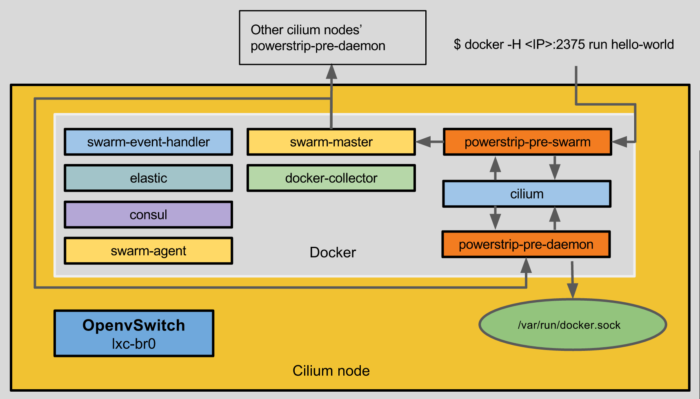

TOC
===
  * [How does it work](#how-does-it-work)
  * [What is a policy file?](#what-is-a-policy-file)
  * [Port assignments](#port-assignments)
  * [Installation for developers](#installation-for-developers)
    * [Single machine architecture](#single-machine-architecture)
      * [Requirements](#requirements)
      * [Getting Cilium](#getting-cilium)
      * [Re-check all dependencies](#re-check-all-dependencies)
      * [Build images for fast import](#build-images-for-fast-import)
      * [Bringing up vagrant environment](#bringing-up-vagrant-environment)
      * [Infecting nodes with cilium](#infecting-nodes-with-cilium)
  * [Makefile options](#makefile-options)

How does it work
================

The following image represents the cilium's node architecture:



1. A docker request (run hello-world above) goes to __powerstrip-pre-swarm__ which
takes care of all pre-hook requests and delivers them to __cilium__ so it can
process it and modify the request if needed it.
2. __swarm-master__ receives the modified requests and sends it to one of the
available nodes in the cluster (can be itself).
3. __powerstrip-pre-daemon__ receives requests from a __swarm-master__ and sends
it to __docker.sock__ running in the physical machine.
4. The response of docker daemon goes back to __powerstrip-pre-daemon__ and then
goes to __cilium__ where, if specified in the policies for that label, takes
care of dealing with: OpenvSwitch rules, DNS entries and the load balancer.
(In this picture the DNS and the load balancer are not present)
5. The response of docker daemon continues back to the __swarm-master__ which
returns back to __powerstrip_pre-swarm__  and to the client that has made the
docker request which, in the example above, is the CLI that executed:
`docker -H <IP>:2375 run hello-world`

The remaining elements:
- __swarm-event-handler__ - listens for docker events running on every node so
it can add or remove, if needed, OpenvSwitch rules locally.
- __elastic__ - distributed database ([ElasticSearch](https://www.elastic.co/))
that contains all policies for further containers that will be deployed by an
operator.
- __swarm-agent__ - sends a keep-alive message to a distributed key-value store
where each swarm-master knows the IP of every node running a particular token
ID.
- __docker-collector__ - a statistics collector for Unix containers
([docker-collector](https://github.com/cilium-team/docker-collector)).

Not shown in the image above but equally important:
- __dns__ - receives the container's IP that it will use and stores it
internally so it can reply to DNS requests from containers created by an
operator.
- __loadbalancer__ - a load balancer ([HAproxy](http://www.haproxy.org/)) that
will take care of load balance the requests of some services.
- __debug__ - a debug container useful for `cilium` contributors. This is a
special container since it will attach itself to the remaining operational and
application network.

# What is a policy file?

A policy file contains all options that you want to enforce in the containers
that you want to run on a cilium cluster. Here's an example:

```yml
---
policy-source:
  -
    # Policies owner
    owner: operator
    # Array of policies
    policies:
      -
        # Policy name
        name: "Web Service"
        # Policy coverage based on docker running labels
        coverage:
          labels:
            com.docker.compose.service: ^web$
        # Intent configuration
        intent-config:
          priority: 250
          config:
            # Net config for containers that will be covered by the coverage
            # above
            net-conf:
              # IP address or pool of IPs
              cidr: "1.1.0.0/25"
              # Network group to enforce rules
              group: 100
            # Enforcement of the max number of containers running with that
            # label
            max-scale: 4
            # Load balancing this service with the help of ha-proxy
            load-balancer:
              name: "ha-proxy"
              traffic-type: "http"
              bind-port: 5000
        # Docker configuration - All options available in docker
        docker-config:
          priority: 1000
          config:
            Hostname: "web"
            Env:
              - "affinity:com.intent.service==gov_swarm_events"
          host-config:
            Hostname: "web"
            NetworkMode: "bridge"
            RestartPolicy:
              Name: "always"
            Dns:
              - "8.8.8.8"
              - "8.8.4.4"
```

All available options in Intent are:

- `add-arguments` - Append *special* arguments to CLI arguments. The example
bellow will add these arguments to the list of arguments to run in docker
`--start tcp://192.168.50.1:8080`, where `$public-ip` was overwritten by the
value of the environment variable `HOST_IP`.
- `add-to-dns` - Adds the container's hostname and the first 12 digits of the
container's ID to the DNS. All containers will be reachable by their hostname
if they belong to the same network.
- `hostname-is` - Sets the container's `hostname` to the value of the given
label.
- `load-balancer`- Adds the container to the load balancer with the given
name.
- `max-scale` - Sets the maximum number of containers running with the given
coverage.
- `net-conf` - Network configuration for the given container. `cidr` - specific
IP address (`1.1.1.1/24`) or network address where cilium keeps the state of
every IP already used (`1.1.0.0/25`). `mac` - MAC address. `group` - network
group number to enforce rules.
- `remove-docker-links` - Removes docker links and applies them via cilium's
internal network. Useful for distributed applications.
- `remove-port-bindings` - Removes docker port bindings. Useful to ensure that
port bindings are only applyed via cilium's internal network.

Intent config example
```yml
intent-config:
  priority: 250
  add-arguments:
    - "--start"
    - "tcp://$public-ip:8080"
  add-to-dns: false
  hostname-is:
    value-of-label: ^com\.intent\.logical-name$
  load-balancer:
    name: "ha-proxy"
    traffic-type: "http"
    bind-port: 5000
  max-scale: 1
  net-conf:
    cidr: "1.1.0.0/25"
    mac: "auto"
    group: 100
  remove-docker-links: true
  remove-port-bindings: true
```

# Port assignments

There're a couple of ports assignment in a cilium's node:
- tcp 2371 - __powerstrip-pre-daemon__
- tcp 2373 - __swarm-master__
- tcp 2375 - __powerstrip-pre-swarm__

Installation for developers
===========================

## Single machine architecture

If you want to developer for `cilium` on you local machine make sure you have
the following requirements:

### Requirements

- Docker (>=1.8.0)
- Go (>=1.4.2)
- [Godep](https://github.com/tools/godep)
- Compose (>=1.3.0)
- Vagrant (>=1.7.2)
- VirtualBox (>=4.3.28)
- Open vSwitch (>=2.3.2)
- ~15 GB free space in disk (for demo purposes)

### Getting Cilium

1. Set `GOPATH` environment variable.
2. `cd $GOPATH`
3. Clone `cilium` into your Go environment:

    ```bash
    $ go get github.com/cilium-team/cilium
    ```
4. Build cilium by running:

    ```bash
    $ make cilium
    ```
5. If everything went fine, there should be a file named `cilium-Linux-x86_64`
in your current directory.

### Re-check all dependencies

Make sure you have all requirements checked.
```bash
$ docker-compose --version
docker-compose version: 1.3.0
CPython version: 2.7.10
OpenSSL version: OpenSSL 1.0.1k-fips 8 Jan 2015
$ vagrant version
Installed Version: 1.7.2
...
$ virtualbox -h
Oracle VM VirtualBox Manager 4.3.28
...
$ ovs-vswitchd -V
ovs-vswitchd (Open vSwitch) 2.3.2
Compiled Jun 19 2015 17:31:28
OpenFlow versions 0x1:0x1
```

### Build images for fast import

We'll download and build all docker images that will be used in our demo.
This allow a faster deployment of docker images in the nodes that we'll create
later with vagrant.

```bash
make build-images
```

This should take around 5 to 10 minutes depending your internet connection.

### Bringing up vagrant environment

Run the following command that will setup 2 vagrant VM nodes.

```bash
make setup-vagrant-machines
```

*You will need to open the ports 80, 2371, 2373, 4789, 5000, 8080, 8300, 8301
(tcp/udp), 8302 (tcp/udp), 8400, 8500 and 9300 on your firewall to receive tcp
traffic and 53, 54328 for udp traffic*

You should have 3 nodes, your host, and 2 virtual ones.
You can access those nodes by executing `vagrant ssh node1` or
`vagrant ssh node2` inside cilium's directory.

### Infecting nodes with cilium

We will now infect a node with `cilium` components (more info about these
components [here](docs/CONTRIBUTING.md#what-is-a-policy-file)) that will allow us to
deploy your applications into your cluster.


The first machine is infected without specifying a master IP which
will trigger creation of a [`consul`](https://www.consul.io/) container.
You may specify the public reachable IP of the node, if omitted, you will be
prompted to select one. Running the following command will infect your machine
with `cilium`.

```bash
sudo IP=192.168.50.1 make infect
```
*If you have permissions to write `/var/run/openvswitch/db.sock` you don't
have to run it as `root`*

If everything went well you should see something similar to:
```
===========================================================================

 Successfully infected node 192.168.50.1

 Master IP: 192.168.50.1

 Further nodes can be infected with: make MASTER_IP=192.168.50.1 infect

===========================================================================
```

And if you execute `docker ps -a` you can see all `cilium` components running:
```bash
$ docker ps --format -a 'table {{.ID}}\t{{.Image}}\t{{.Status}}\t{{.Names}}'
CONTAINER ID        IMAGE                              STATUS              NAMES
02baa66af170        cilium/docker-collector:latest     Up 3 minutes        cilium-docker-collector
9f12c0c10736        cilium/cilium                      Up 3 minutes        cilium-swarm-event-handler
5e6340c9740a        swarm:0.4.0                        Up 4 minutes        cilium-swarm-master
7a0586781c17        swarm:0.4.0                        Up 4 minutes        cilium-swarm-agent
810972c7d0ef        cilium/powerstrip:latest           Up 4 minutes        cilium-powerstrip-pre-daemon
4968c7d9a70e        cilium/powerstrip:latest           Up 4 minutes        cilium-powerstrip-pre-swarm
7757de87029b        cilium/cilium                      Up 4 minutes        cilium
1f554b8873e7        elasticsearch:1.7.1                Up 4 minutes        cilium-elastic
d9108783a68b        progrium/consul                    Up 4 minutes        cilium-consul
```

All further nodes can be infected by specifying the `consul`'s `MASTER_IP`
(it can be any machine's IP with consul running):

```bash
# You don't need to run this command
# MASTER_IP=192.168.50.1 make infect
```

Since we have 2 vagrant nodes running, we can execute those commands that will
infect the remaining 2 nodes with `cilium` components:
```bash
vagrant ssh -c 'cd cilium; sudo MASTER_IP=192.168.50.1 IP=192.168.50.5 make infect' node1
# The next command has a different MASTER_IP to show you
# that it can be any IP that was previously infected with cilium
vagrant ssh -c 'cd cilium; sudo MASTER_IP=192.168.50.5 IP=192.168.50.6 make infect' node2
```

We now have all nodes infected with `cilium` and if you execute
`swarm-master docker ps -a` you'll see all nodes running with `cilium` components:

*(you probably don't have the `swarm-master` command, please go
[here](../README.md#why-am-i-getting-json-cannot-unmarshal-number-into-go-value-of-type-typescontainer))*

```
$ docker-master docker ps -a  --format 'table {{.ID}}\t{{.Image}}\t{{.Status}}\t{{.Names}}'
CONTAINER ID        IMAGE                              STATUS              NAMES
d141780d59b2        cilium/docker-collector:latest     Up 6 minutes        node2/cilium-docker-collector
cf3e329c9a24        cilium/cilium                      Up 6 minutes        node2/cilium-swarm-event-handler
f4ca2699a644        swarm:0.4.0                        Up 6 minutes        node2/cilium-swarm-master
5983cec8cc1b        swarm:0.4.0                        Up 6 minutes        node2/cilium-swarm-agent
24af1ac8e4a3        cilium/powerstrip:latest           Up 7 minutes        node2/cilium-powerstrip-pre-daemon
3befe78a69cc        cilium/powerstrip:latest           Up 7 minutes        node2/cilium-powerstrip-pre-swarm
a80915511fe2        cilium/cilium                      Up 7 minutes        node2/cilium
6cf49abe8237        elasticsearch:1.7.1                Up 7 minutes        node2/cilium-elastic
30343151fde0        progrium/consul                    Up 7 minutes        node2/cilium-consul
fe0c2883cd36        cilium/docker-collector:latest     Up 7 minutes        node1/cilium-docker-collector
61b2f42c6286        cilium/cilium                      Up 7 minutes        node1/cilium-swarm-event-handler
781156cf2c4d        swarm:0.4.0                        Up 7 minutes        node1/cilium-swarm-master
28bcfd87d4e2        swarm:0.4.0                        Up 7 minutes        node1/cilium-swarm-agent
ddc75b3cfe83        cilium/powerstrip:latest           Up 7 minutes        node1/cilium-powerstrip-pre-daemon
f9dbc2892627        cilium/powerstrip:latest           Up 7 minutes        node1/cilium-powerstrip-pre-swarm
16d403b12c77        cilium/cilium                      Up 7 minutes        node1/cilium
02baa66af170        cilium/docker-collector:latest     Up 7 minutes        localhost/cilium-docker-collector
9f12c0c10736        cilium/cilium                      Up 7 minutes        localhost/cilium-swarm-event-handler
d9d304ac09f6        elasticsearch:1.7.1                Up 7 minutes        node1/cilium-elastic
a7838bdc7061        progrium/consul                    Up 7 minutes        node1/cilium-consul
5e6340c9740a        swarm:0.4.0                        Up 7 minutes        localhost/cilium-swarm-master
7a0586781c17        swarm:0.4.0                        Up 7 minutes        localhost/cilium-swarm-agent
810972c7d0ef        cilium/powerstrip:latest           Up 7 minutes        localhost/cilium-powerstrip-pre-daemon
4968c7d9a70e        cilium/powerstrip:latest           Up 7 minutes        localhost/cilium-powerstrip-pre-swarm
7757de87029b        cilium/cilium                      Up 7 minutes        localhost/cilium
1f554b8873e7        elasticsearch:1.7.1                Up 7 minutes        localhost/cilium-elastic
d9108783a68b        progrium/consul                    Up 7 minutes        localhost/cilium-consul
```

Now we'll deploy all policies under `policy` directory in our ElasticSearch
containers by running:
```bash
make refresh-policy
```

On our cluster we'll need a DNS and a load balancer service running. The DNS
container will take care of knowing which IPs belong to which container and
the load balancer will take care of load balancing services that we'll run:
```bash
make setup-services
```

You can look at where those services are running in your cluster

```
$ docker-master docker ps -a  --format 'table {{.ID}}\t{{.Image}}\t{{.Status}}\t{{.Names}}'
CONTAINER ID        IMAGE                                    STATUS              NAMES
bd820c3fa3fc        cilium/docker-dns-rest:1.0-rr-with-del   Up 6 minutes        localhost/cilium-dns
753a75b39dff        tnolet/haproxy-rest                      Up 6 minutes        node1/cilium-loadbalancer
```

Congratulations you have setup a `cilium` cluster in your physical machine,
go to the [compose-example](https://github.com/cilium-team/cilium#compose-demo)
step to complete the demo.

# Makefile options
There are a couple of targets available for developers in the root's Makefile.

- __build-images__ - Pulls and creates all necessary docker images used by a
cilium node inside `images/` directory.
- __cilium-binary__ - Builds the cilium binary inside docker and copies the
binary to the root's project.
- __cilium-image__ - Builds cilium's docker image with the tag `latest`.
- __cilium__ - Produces the cilium binary.
- __clean-containers__ - Cleans all containers with that have the name "cilium"
in the node that is executed.
- __clean-images__ - Deletes all images that are inside `images/` directory.
- __clean-swarm-vms__ - Stop and deletes all vagrant VMs created by this
project (node1 and node2).
- __import-images__ - Imports all images inside `images/` to the current host.
Essentially used by the nodes when redeploying images.
- __infect__ - Cilium's infection in the current node.
- __redeploy-cilium-image__ - Re-deploys the cilium docker image under `images/`
directory inside vagrant node1 and vagrant node2.
- __redeploy-images__ - Re-deploys all docker images under `images/` (including
cilium image inside vagrant node1 and vagrant node2.
- __refresh-policy__ - Cleans and put all policies inside `policy/` directory
in the ElasticSearch container.
- __reset-cluster__ - Cleans all containers from host, vagrant node1 and vagrant
node2 and starts again all cilium's components in this private cluster.
- __run-kibana__ - Runs a [Kibana](https://www.elastic.co/products/kibana)
container, useful to see some data graphs.
- __setup-vagrant-machines__ - Creates and setups all vagrant nodes necessary
for development (node1 and node2).
- __shell__ - Debug container used to debug possible network problems inside
the development and application network created by cilium.
- __tests__ - Performs cilium's unit tests.
- __update-godeps__ - Useful to update all Godeps inside the `Godeps`
directory.
